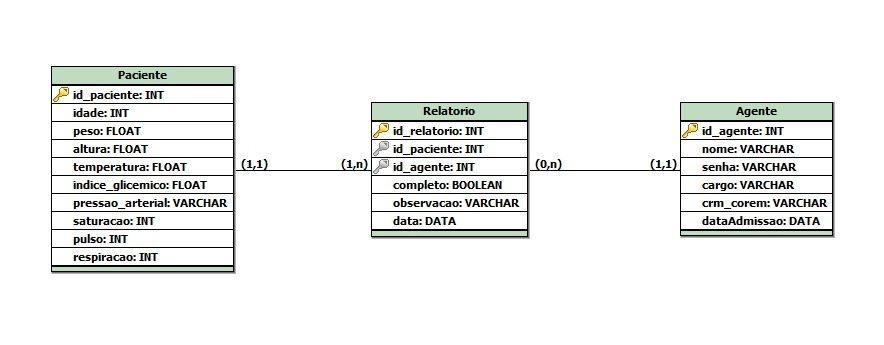

.png)

# 🩺 SmartVital - API

**Plataforma de Gestão e Monitoramento de Saúde**

A **SmartVital API** é uma aplicação **RESTful** desenvolvida para a gestão digital e segura de dados críticos em saúde. Ela centraliza o **monitoramento de pacientes**, o **cadastro de profissionais de saúde (Agentes)** e a **emissão rastreável de relatórios clínicos**.

**Público-Alvo:** Hospitais, Unidades de Terapia Intensiva (UTIs) e Clínicas.

| Capacidade | Benefício |
| :--- | :--- |
| **Monitoramento Integrado** | Coleta e visualização de sinais vitais em um ponto central. |
| **Padronização de Dados** | Garante a uniformidade e confiabilidade das informações clínicas. |
| **Rastreabilidade** | Associa cada ação e relatório a um profissional responsável. |

-----

## 1\. ⚙️ Especificações Técnicas e Protocolo

Detalhes sobre a arquitetura de comunicação da API.

| Parâmetro | Detalhe | Observações |
| :--- | :--- | :--- |
| **Arquitetura** | RESTful | Utiliza verbos HTTP para manipulação de recursos. |
| **Formato de Dados** | JSON | Utilizado para *Requests* e *Responses*. |
| **Codificação** | UTF-8 | Suporte completo a caracteres especiais. |
| **Autenticação** | Nenhuma | **Modo de Desenvolvimento/Simulação**. Requer JWT/OAuth2 em Produção. |
| **Códigos de Sucesso** | 200, 201, 204 | Padrão REST para operações bem-sucedidas. |
| **Códigos de Erro** | 400, 404, 500 | Padrão REST para indicar falhas (Cliente ou Servidor). |

### 1.1. Códigos de Resposta HTTP

| Código | Status | Descrição | Uso Principal |
| :--- | :--- | :--- | :--- |
| `200` | OK | Requisição bem-sucedida. | Retorno de dados, Atualização (PUT, PATCH). |
| `201` | Created | Novo recurso criado com sucesso. | Criação de novos recursos (POST). |
| `204` | No Content | Requisição processada, sem corpo de resposta. | Remoção de recursos (DELETE). |
| `400` | Bad Request | Erro nos dados enviados (ex: JSON inválido, campos obrigatórios ausentes). | Falha de validação. |
| `404` | Not Found | Recurso solicitado (endpoint ou ID) não encontrado. | Tentativa de acessar um recurso inexistente. |
| `500` | Internal Server Error | Falha inesperada no servidor. | Erro interno do sistema. |

-----

## 2\. 🧩 Modelagem de Dados

O modelo de dados é composto por três entidades principais inter-relacionadas, seguindo boas práticas de normalização e rastreabilidade.

### 2.1. 👤 Entidade: Paciente

Representa o indivíduo sob monitoramento, incluindo seus dados básicos e o estado mais recente dos sinais vitais.

| Campo | Tipo | Descrição | Restrição | Unidade/Exemplo |
| :--- | :--- | :--- | :--- | :--- |
| `id` | `number` (Int) | Identificador único do paciente. | **PK**, Auto-gerado. | - |
| `nome` | `string` | Nome completo. | Obrigatório. | - |
| `idade` | `number` (Int) | Idade em anos. | Opcional (`null`). | Anos |
| `peso` | `number` (Decimal) | Massa corporal. | Opcional (`null`). | kg |
| `altura` | `number` (Decimal) | Altura. | Opcional (`null`). | m |
| `temperatura` | `number` (Decimal) | Temperatura corporal. | Opcional (`null`). | °C |
| `indice_glicemico` | `number` (Int) | Nível de glicose no sangue. | Opcional (`null`). | mg/dL |
| `pressao_arterial` | `string` | Pressão arterial no formato `"sistólica/diastólica"`. | Opcional (`null`). | `"120/80"` |
| `saturacao` | `number` (Int) | Saturação de oxigênio no sangue. | Opcional (`null`). | % |
| `pulso` | `number` (Int) | Frequência cardíaca. | Opcional (`null`). | bpm |
| `respiracao` | `number` (Int) | Frequência respiratória. | Opcional (`null`). | rpm |

### 2.2. 🧑‍⚕️ Entidade: Agente de Saúde

Representa médicos, enfermeiros ou outros profissionais com credenciais de acesso e registro.

| Campo | Tipo | Descrição | Restrição | Formato/Exemplo |
| :--- | :--- | :--- | :--- | :--- |
| `id` | `number` (Int) | Identificador único do agente. | **PK**, Auto-gerado. | - |
| `nome` | `string` | Nome completo do profissional. | Obrigatório. | - |
| `senha` | `string` | Credencial de acesso (deve ser armazenada com hash). | Obrigatório. | - |
| `cargo` | `string` | Função exercida na instituição. | Obrigatório. | `"Médico"`, `"Enfermeiro"`, `"Fisioterapeuta"` |
| `registro_profissional` | `string` | Número de registro no conselho de classe. | Obrigatório, Único. | CRM, COREN, etc. |
| `data_admissao` | `string` | Data de admissão na instituição. | Obrigatório. | ISO (`YYYY-MM-DD`) |

### 2.3. 📄 Entidade: Relatório Clínico

Armazena as observações médicas registradas por agentes sobre o estado dos pacientes.

| Campo | Tipo | Descrição | Restrição | Formato/Exemplo |
| :--- | :--- | :--- | :--- | :--- |
| `id` | `number` (Int) | Identificador único do relatório. | **PK**, Auto-gerado. | - |
| `id_paciente` | `number` (Int) | ID do paciente associado. | **FK** (`pacientes.id`), Obrigatória. | - |
| `id_agente` | `number` (Int) | ID do agente responsável pelo registro. | **FK** (`agentes.id`), Obrigatório. | - |
| `observacao` | `string` | Texto descritivo sobre o estado clínico/evolução. | Obrigatório. | - |
| `data_registro` | `string` | Data e hora exata da criação. | Auto-gerado. | ISO (`YYYY-MM-DDTHH:mm:ssZ`) |
| `completo` | `boolean` | Indica se o relatório foi concluído ou está em rascunho. | Obrigatório. | `true` ou `false` |

### 2.4. 🧱 Modelo Entidade-Relacionamento (MER)

O modelo é baseado em relacionamentos 1:N que garantem a integridade referencial e rastreabilidade dos dados.



| Entidade | Chave Primária | Atributos Representativos |
| :--- | :--- | :--- |
| **Paciente** | `id` | `nome`, `idade`, `temperatura`, `pressao_arterial`, etc. |
| **Agente** | `id` | `nome`, `cargo`, `registro_profissional`. |
| **Relatório** | `id` | `observacao`, `data_registro`, `completo`. |

#### 🔗 Detalhes de Relacionamentos e Cardinalidades

| Relação | Tipo | Chave Estrangeira | Integridade |
| :--- | :--- | :--- | :--- |
| **Paciente possui Relatórios** | **1:N** | `relatorios.id_paciente` | **Obrigatória:** Um relatório deve sempre pertencer a um paciente. |
| **Agente registra Relatórios** | **1:N** | `relatorios.id_agente` | **Opcional:** Um relatório pode ser gerado automaticamente (sem agente) ou estar pendente de atribuição. |
| **Integridade de Dados** | - | - | A exclusão de um **Paciente** implica a remoção em cascata de todos os seus **Relatórios** associados. |

-----

[Link para o Postman](https://arthursteinerr-4295979.postman.co/workspace/Arthur-Steiner's-Workspace~3abe7c33-dc8c-47a6-8e21-6f6a7a03e4fe/folder/47732566-e27cd709-1f8c-4e58-ba6b-5944be1b2514?action=share&source=copy-link&creator=47732566&ctx=documentation)


## 👥 3. Endpoints de Pacientes (`/pacientes`)

### 3.1. POST `/pacientes` (Criação)

Cria um novo paciente no sistema, inicializando os sinais vitais como `null`.

**📨 Request Body:**

```json
{
  "nome": "Henrique Pereira",
  "idade": 30,
  "peso": 75.0,
  "altura": 1.70
}
```

**📤 Response (201 Created):** Retorna o objeto completo com o `id` gerado e campos de sinais vitais vazios.

```json
{
  "id": 1,
  "nome": "Henrique Pereira",
  "idade": 30,
  "peso": 75.0,
  "altura": 1.70,
  "temperatura": null,
  "indice_glicemico": null,
  "pressao_arterial": null,
  "saturacao": null,
  "pulso": null,
  "respiracao": null
}
```

### 3.2. GET `/pacientes` (Listagem)

Obtém uma lista de todos os pacientes registrados.

**📤 Response (200 OK):**

```json
[
  {
    "id": 1,
    "nome": "Henrique Pereira",
    "idade": 30,
    "peso": 75.0,
    "altura": 1.70,
    "pressao_arterial": "120/80",
    "saturacao": 98
  },
  {
    "id": 2,
    "nome": "Maria Souza",
    "idade": 42,
    "peso": 68.5,
    "altura": 1.65,
    "pressao_arterial": "130/85",
    "saturacao": 97
  }
]
```

### 3.3. GET `/pacientes/{id}` (Detalhe)

Busca as informações detalhadas de um paciente específico, incluindo os sinais vitais mais recentes.

**Parâmetro de URL:** `{id}` - ID do paciente.

**📤 Response (200 OK):**

```json
{
  "id": 1,
  "nome": "Henrique Pereira",
  "idade": 30,
  "peso": 75.0,
  "altura": 1.70,
  "temperatura": 36.8,
  "indice_glicemico": 95,
  "pressao_arterial": "120/80",
  "saturacao": 98,
  "pulso": 75,
  "respiracao": 16
}
```

### 3.4. PUT `/pacientes/{id}` (Atualização Completa)

Atualiza **todos os campos** do paciente (pessoais e vitais). Requer o envio de todos os campos da entidade.

**Parâmetro de URL:** `{id}` - ID do paciente.

**📨 Request Body:**

```json
{
  "nome": "Henrique Pereira",
  "idade": 31,
  "peso": 76.2,
  "altura": 1.70,
  "temperatura": 37.0,
  "indice_glicemico": 100,
  "pressao_arterial": "118/79",
  "saturacao": 99,
  "pulso": 80,
  "respiracao": 18
}
```

**📤 Response (200 OK):** Retorna o objeto com os dados atualizados.

```json
{
  "id": 1,
  "nome": "Henrique Pereira",
  "idade": 31,
  "peso": 76.2,
  "altura": 1.70,
  "temperatura": 37.0,
  "indice_glicemico": 100,
  "pressao_arterial": "118/79",
  "saturacao": 99,
  "pulso": 80,
  "respiracao": 18
}
```

### 3.5. PATCH `/pacientes/{id}/peso` (Atualização Parcial: Peso)

Atualiza **somente o peso** do paciente.

**Parâmetro de URL:** `{id}` - ID do paciente.

**📨 Request Body:**

```json
{
  "peso": 77.3
}
```

**📤 Response (200 OK):**

```json
{
  "id": 1,
  "peso": 77.3
}
```

### 3.6. PATCH `/pacientes/{id}/idade` (Atualização Parcial: Idade)

Atualiza **somente a idade** do paciente.

**Parâmetro de URL:** `{id}` - ID do paciente.

**📨 Request Body:**

```json
{
  "idade": 32
}
```

**📤 Response (200 OK):**

```json
{
  "id": 1,
  "idade": 32
}
```

### 3.7. PATCH `/pacientes/{id}/pressao` (Atualização Parcial: Pressão)

Atualiza **somente a pressão arterial** do paciente.

**Parâmetro de URL:** `{id}` - ID do paciente.

**📨 Request Body:**

```json
{
  "pressao_arterial": "125/83"
}
```

**📤 Response (200 OK):**

```json
{
  "id": 1,
  "pressao_arterial": "125/83"
}
```

### 3.8. GET `/pacientes/{id}/sinais-vitais` (Somente Sinais Vitais)

Retorna exclusivamente os sinais vitais do paciente, sem dados de identificação pessoal.

**Parâmetro de URL:** `{id}` - ID do paciente.

**📤 Response (200 OK):**

```json
{
  "id": 1,
  "temperatura": 36.9,
  "indice_glicemico": 98,
  "pressao_arterial": "120/80",
  "saturacao": 97,
  "pulso": 76,
  "respiracao": 17
}
```

### 3.9. DELETE `/pacientes/{id}` (Remoção)

Remove permanentemente um paciente e todos os seus relatórios clínicos associados.

**Parâmetro de URL:** `{id}` - ID do paciente.

**📤 Response (204 No Content):**

```
Sem conteúdo
```

-----

## 4\. Endpoints de Agentes de Saúde (`/agentes`)

### 4.1. POST `/agentes` (Criação)

Cria um novo registro para um profissional de saúde.

**📨 Request Body:**

```json
{
  "nome": "Dra. Camila Nunes",
  "senha": "12345",
  "cargo": "Médico",
  "registro_profissional": "CRM-SP-456789",
  "data_admissao": "2022-10-05"
}
```

**📤 Response (201 Created):** O campo `senha` não deve ser retornado por questões de segurança.

```json
{
  "id": 1,
  "nome": "Dra. Camila Nunes",
  "cargo": "Médico",
  "registro_profissional": "CRM-SP-456789",
  "data_admissao": "2022-10-05"
}
```

### 4.2. GET `/agentes` (Listagem)

Lista todos os agentes de saúde registrados.

**📤 Response (200 OK):**

```json
[
  {
    "id": 1,
    "nome": "Dra. Camila Nunes",
    "cargo": "Médico",
    "registro_profissional": "CRM-SP-456789",
    "data_admissao": "2022-10-05"
  },
  {
    "id": 2,
    "nome": "Enf. Pedro Lima",
    "cargo": "Enfermeiro",
    "registro_profissional": "COREN-123456",
    "data_admissao": "2023-01-11"
  }
]
```

### 4.3. GET `/agentes/{id}` (Detalhe)

Retorna as informações de um agente específico.

**Parâmetro de URL:** `{id}` - ID do agente.

**📤 Response (200 OK):**

```json
{
  "id": 1,
  "nome": "Dra. Camila Nunes",
  "cargo": "Médico",
  "registro_profissional": "CRM-SP-456789",
  "data_admissao": "2022-10-05"
}
```

### 4.4. PATCH `/agentes/{id}` (Atualização Parcial)

Atualiza informações parciais de um agente (ex: `cargo`).

**Parâmetro de URL:** `{id}` - ID do agente.

**📨 Request Body:**

```json
{
  "cargo": "Chefe Médico"
}
```

**📤 Response (200 OK):**

```json
{
  "id": 1,
  "nome": "Dra. Camila Nunes",
  "cargo": "Chefe Médico",
  "registro_profissional": "CRM-SP-456789",
  "data_admissao": "2022-10-05"
}
```

### 4.5. DELETE `/agentes/{id}` (Remoção)

Remove permanentemente um agente de saúde.

**Parâmetro de URL:** `{id}` - ID do agente.

**📤 Response (204 No Content):**

```
Sem conteúdo
```

-----

## 5\. Endpoints de Relatórios Clínicos (`/relatorios`)

### 5.1. POST `/relatorios` (Criação)

Cria um novo relatório clínico, associando IDs de paciente e agente.

**📨 Request Body:**

```json
{
  "id_paciente": 1,
  "id_agente": 1,
  "observacao": "Paciente apresentou febre leve e dor de cabeça.",
  "completo": false
}
```

**📤 Response (201 Created):** O campo `data_registro` é gerado automaticamente pelo servidor.

```json
{
  "id": 1,
  "id_paciente": 1,
  "id_agente": 1,
  "observacao": "Paciente apresentou febre leve e dor de cabeça.",
  "data_registro": "2025-10-21T14:35:00Z",
  "completo": false
}
```

### 5.2. GET `/relatorios/{id}` (Detalhe)

Retorna os detalhes de um relatório clínico específico.

**Parâmetro de URL:** `{id}` - ID do relatório.

**📤 Response (200 OK):**

```json
{
  "id": 1,
  "id_paciente": 1,
  "id_agente": 1,
  "observacao": "Paciente apresentou febre leve e dor de cabeça.",
  "data_registro": "2025-10-21T14:35:00Z",
  "completo": false
}
```

### 5.3. GET `/pacientes/{id}/relatorios` (Relatórios por Paciente)

Lista todos os relatórios clínicos associados a um paciente específico.

**Parâmetro de URL:** `{id}` - ID do paciente.

**📤 Response (200 OK):**

```json
[
  {
    "id": 1,
    "id_paciente": 1,
    "id_agente": 1,
    "observacao": "Paciente apresentou febre leve e dor de cabeça.",
    "data_registro": "2025-10-21T14:35:00Z",
    "completo": false
  },
  {
    "id": 2,
    "id_paciente": 1,
    "id_agente": 2,
    "observacao": "Melhora clínica após uso de medicação.",
    "data_registro": "2025-10-22T09:20:00Z",
    "completo": true
  }
]
```

### 5.4. PATCH `/relatorios/{id}` (Atualização Parcial)

Atualiza a observação e/ou o status de conclusão (`completo`) do relatório.

**Parâmetro de URL:** `{id}` - ID do relatório.

**📨 Request Body:**

```json
{
  "observacao": "Paciente evoluiu bem após medicação.",
  "completo": true
}
```

**📤 Response (200 OK):**

```json
{
  "id": 1,
  "id_paciente": 1,
  "id_agente": 1,
  "observacao": "Paciente evoluiu bem após medicação.",
  "data_registro": "2025-10-21T14:35:00Z",
  "completo": true
}
```

### 5.5. GET `/relatorios/pendentes` (Consulta por Status)

Lista todos os relatórios clínicos que estão com o status `completo: false` (em andamento ou pendentes de finalização).

**📤 Response (200 OK):**

```json
[
  {
    "id": 3,
    "id_paciente": 2,
    "id_agente": 1,
    "observacao": "Em observação pós-operatória.",
    "data_registro": "2025-10-20T16:00:00Z",
    "completo": false
  }
]
```

-----

## 6\. Resumo Técnico e Tabela de Endpoints

Resumo geral da arquitetura de endpoints por entidade.

| Entidade | Prefixo do Endpoint | Total de Endpoints | Chave Primária (PK) | Relacionamentos (FK) |
| :--- | :--- | :--- | :--- | :--- |
| **Paciente** | `/pacientes` | 9 | `id` | - |
| **Agente de Saúde** | `/agentes` | 5 | `id` | - |
| **Relatório Clínico** | `/relatorios` | 5 | `id` | `id_paciente`, `id_agente` |

**Total de Endpoints Implementados:** 19
